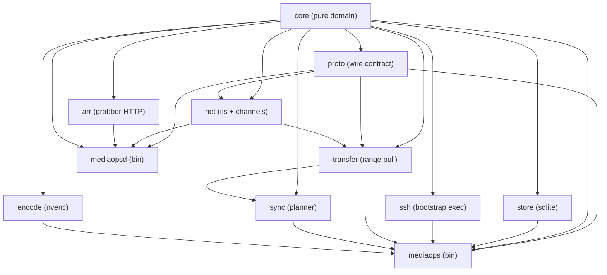
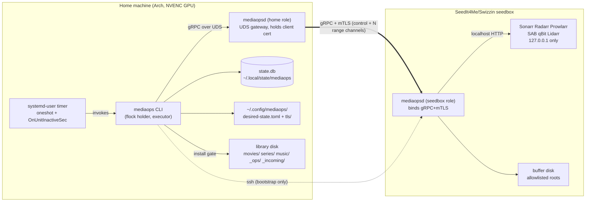

# Architecture Spine — mediaops

> **Historical architecture, superseded by the Home API rewrite.** The original
> design and review record below are retained, not updated implementation law.
> Use [docs/architecture.md](../../../../docs/architecture.md) and the current
> [crate-boundary tests](../../../../crates/arch-tests/src/lib.rs).

## Design Paradigm

**Plan/apply reconciler** (Terraform/Kubernetes-controller style): the only user-facing input is a declarative desired-state document; every mutation is an action in a first-class Plan applied as idempotent transactions; running twice is a no-op when reality matches. The reconciler is built as a **Cargo workspace of thick library crates behind two thin binaries** (`mediaops` CLI, `mediaopsd` daemon), with **ports-and-adapters edges**: every side effect (grabber HTTP, subprocesses, sqlite, the wire) sits behind a trait so the failure-history suite replays offline.

Layer map: `core` = pure domain (identity, schema, policies, plan, budgets, jobs — no I/O); `proto` = wire contract; `store`/`net`/`ssh`/`arr`/`transfer`/`encode` = adapters; `sync` = plan/apply orchestration around a pure planning function; binaries = composition roots.

## Invariants & Rules

### AD-1 — Thick libraries, two thin binaries [ADOPTED]

- **Binds:** all
- **Prevents:** capability logic accreting in binaries; a second ad-hoc API surface growing beside the CLI
- **Rule:** `mediaops` (CLI) and `mediaopsd` (daemon) are composition roots only: parse/serve, snapshot config, take lock, call library crates, render output. Any logic a test would want lives in a library crate. Every capability is a subcommand with `--json`.

### AD-2 — Crate dependency direction is law, enforced in CI

- **Binds:** all
- **Prevents:** grabber HTTP leaking into the CLI; transfer growing an SSH/FTP path; core acquiring I/O; two crates each linking their own HTTP stack
- **Rule:** only the edges in this diagram are legal. A member crate `crates/arch-tests` (a real package, since the workspace root is a virtual manifest that compiles no tests) walks `cargo_metadata` and fails CI unless the workspace-internal dependency graph is a **subgraph of exactly this diagram**, plus external bans: `reqwest` only under `arr`; `rusqlite` only under `store`; `encode` and `store` never in the `mediaopsd` tree; `rsync`/`rclone`/`ftp`/`ssh2`/`russh`/`ffmpeg-next`/`native-tls` nowhere.



### AD-3 — One wire contract: the proto crate

- **Binds:** daemon, cli, transfer, net
- **Prevents:** daemon and clients drifting on RPC shapes; conversions duplicated per consumer
- **Rule:** all `.proto` files live in the `proto` crate under package `mediaops.v1`, generated at build time by `tonic-prost-build` (tonic 0.14 split prost codegen out of `tonic-build`; the runtime pair is `tonic` + `tonic-prost`). `proto` depends on `core` and is the **sole** home of wire↔domain `From`/`TryFrom` conversions. Wire evolution is additive-only within `mediaops.v1`; removing or retyping a field means a new package version. No hand-written RPC types anywhere. Two further sole-ownership rules: `core` defines the `ControlPort` trait (Unmonitor, DeleteRemote, GrabApply, EdgeCheck, Df, KeyDiscovery, guard preview) and `proto` ships its one canonical implementation over the generated clients — `sync` consumes the trait, binaries inject it; and `proto` defines `mediaops.v1.ErrorDetail {exit_code, reason, message}` plus the only two functions that build a `tonic::Status` from a domain error and parse one back — both binaries use them, nothing else constructs a `Status`.

### AD-4 — Executor split: CLI executes, home daemon is a gateway [ASSUMPTION]

- **Binds:** CAP-1, CAP-4, CAP-7, CAP-10; cli, daemon, transfer, sync, encode
- **Prevents:** two owners of staging and jobs; work outliving the flock holder; the lock reporting a holder that isn't doing the work
- **Rule:** the CLI process holding the machine-global flock is the **only executor** of plan/apply/pull/verify/install/encode — the code lives in the `sync`/`transfer`/`encode` libraries it calls. Home `mediaopsd` is an **overlay gateway only**: it holds the mTLS client identity, re-serves the seedbox services on the unix socket, and proxies control and Range streams — forwarding upstream `Status` code, message, and details byte-for-byte, never re-wrapping. It never writes staging or library paths and owns no job logic. All seedbox traffic flows CLI → UDS → home mediaopsd → mTLS/TCP → seedbox mediaopsd; the CLI's only configured endpoint is the UDS path — the seedbox address and identity live solely in home mediaopsd's config. **Planning is home-side:** there is no remote Plan RPC; the seedbox `Control` service supplies remote snapshots (listing, df, grabber state, key discovery) and executes remote mutations (grabber set-diff applies, Unmonitor, DeleteRemote, edge checks). **The qBit seeding guard lives inside the seedbox `DeleteRemote` handler** — query and unlink in one handler with no wire round-trip between them, returning a typed `SkippedSeeding` outcome; a standalone guard RPC exists only for preview/`why` rendering and is never the precondition for a delete. **Lock classes are fixed:** exclusive verbs (plan, apply, run, sync resume, encode run, reclaim apply, repair, bootstrap) take the flock; lock-free verbs (watch, why, status, hold list/approve/reject, reclaim preview, encode pause, docs render) may only perform single-transaction row writes through `store` — the executor treats those tables as plan-time snapshots (new rows are next-run input, never mid-apply input), and `encode pause` is a store flag the executor polls between jobs, never a signal to the lock holder.

### AD-5 — One daemon binary, role from config [ADOPTED, sharpened]

- **Binds:** CAP-5, CAP-6; daemon, net
- **Prevents:** a fork between "seedbox daemon" and "home daemon" codebases; reverse-connect landing as a third binary
- **Rule:** `mediaopsd` is one binary whose role comes from its config: **seedbox role** binds TCP gRPC+mTLS serving `Control` + `Transfer` and owns the only localhost grabber-HTTP clients; **home role** binds the unix socket as gateway. Reverse-connect stays a designed-unused mode of this same binary.

### AD-6 — Three data tiers; every value lives in exactly one

- **Binds:** all
- **Prevents:** probe results written into git config; budgets hardcoded; app state edited by hand
- **Rule:** (1) **desired-state** — user-edited TOML, git-versionable, snapshotted per plan; budgets, policies, pins, fingerprints, range_len live here. (2) **machine state** — sqlite + probe outcomes (Range N, NVENC cap, probed binary paths), app-owned, never git. (3) **runtime artifacts** — lockfile, `.partial` + sidecar, `tls/` PEMs, and plan JSONs under `~/.local/state/mediaops/plans/` (a plan is deleted by the `run` that completes it; stale plans are pruned only by an explicit command). Nothing app-owned is user-edited; nothing user-edited is machine-written except by an explicit command that shows a diff.

### AD-7 — Config home layout [ASSUMPTION]

- **Binds:** CAP-5, CAP-6, CAP-12; cli, ssh, net
- **Prevents:** PEMs landing in a git work tree; two builders inventing different config locations; the "next to desired-state" and "never in a work tree" locks colliding
- **Rule:** the **active** config dir defaults to `~/.config/mediaops/` and holds `desired-state.toml` + `tls/`; machine state lives in `~/.local/state/mediaops/` (XDG). Bootstrap refuses to mint certs into a git work tree; doctor refuses PEMs found inside one. The user may version `desired-state.toml` in the repo of record; the active dir itself is never a work tree. `new-machine` export bundles desired-state + tls/ + title-index export; **import populates the active config dir and machine state — never a work tree**. `library relocate` rewrites schema roots, systemd units, and title-index paths through the same config/store owners, never by hand.

### AD-8 — One sqlite, one owner

- **Binds:** CAP-1, CAP-3, CAP-4, CAP-7, CAP-8, CAP-10; store, sync, encode, cli
- **Prevents:** sync and encode each opening their own DB or ad-hoc JSON state files; schema drift between writers
- **Rule:** one home `state.db`, touched only by the `store` crate (rusqlite behind `spawn_blocking`); embedded migrations via `PRAGMA user_version`; tables `title_index`, `jobs`, `probes`, `holds_decisions`. **Repository traits live in `core`; `store` is their one adapter; binaries inject it** — no other crate names rusqlite or a connection. Title-index export/import (the `new-machine` flow) is a `store` API, and the export includes install digests — `state.db` loss without an export means reclaim has no proof and refuses until a `library reindex` re-hashes local files (a digest is present or the delete does not happen). `title_index` carries two digests: `install_b3` (immutable — the reclaim/local-proof digest) and `current_b3` (updated only by the install gate on install or replace — what `verify` checks). `holds_decisions` is keyed by `HoldKey {title_id, release_id}` where `release_id` is the durable release identifier (usenet: NZB-name hash; torrent: infohash), defined in `core`, carried verbatim in `proto` hold messages, mapped from Servarr queue items only inside `arr`; the inbox join (live ⊖ decided) is computed in `sync`, nowhere else. The seedbox daemon keeps no sqlite in v1 — neither daemon role links `store`.

### AD-9 — The plan carries its own config

- **Binds:** CAP-2, CAP-7; core, sync, cli
- **Prevents:** hot-reload mid-copy; plan and apply reading different configs; a second plan format
- **Rule:** a Plan is a JSON artifact embedding the **exact raw TOML bytes** of the snapshotted desired-state file plus `blake3(bytes)`; apply re-parses config **only from the embedded bytes**, never from disk, and refuses when the embedded hash no longer matches the active desired-state file. Every snapshot-hash comparison anywhere is bytes-hash vs bytes-hash; no canonical-serialization hashing exists. `core` owns the `DesiredState` type (serde TOML, `deny_unknown_fields`, `schema_version`). `Action` is one exhaustive Rust enum — `Copy, Skip, Review, Unmonitor, DeleteRemote, Encode, Reclaim, EdgeApply, GrabApply` — matched with a `never` default per workspace rule. `run` = plan then apply of that exact artifact in the same locked process.

### AD-10 — Everything long-running is a job row

- **Binds:** CAP-1, CAP-4, CAP-8, CAP-10; core, store, sync, encode
- **Prevents:** each subsystem inventing its own progress tracking; timers re-doing finished work; crash recovery by guesswork
- **Rule:** every long-running operation (want, pull, encode, hold) is a `jobs` row with a typed per-kind state machine. **`core::jobs` owns `JobKind`, the per-kind state enums, and `advance(state, event) -> Result<State>` as pure functions**; the jobs repository trait (in `core`, implemented by `store`) persists only these types and exposes `advance` as the sole state write — an illegal transition is a repository error, not a caller convention. The planner creates one job row per Plan action linked to its originating want by `parent_job_id`; readiness predicates (e.g. an Encode job is ready when its parent Copy job is Installed) are evaluated by `core::jobs`, not by `sync` or `encode`. A timer-invoked `run` advances **ready** jobs under ResourceBudget and exits. Crash recovery derives from job state + runtime artifacts (the `.partial` sidecar), never from re-scanning and hoping.

### AD-11 — `.partial` staging format [ASSUMPTION]

- **Binds:** CAP-4; transfer, core
- **Prevents:** two incompatible resume formats; a "completed" range that never hit disk; GC misjudging what is sacred
- **Rule:** staging writes `<final-name>.partial` plus sidecar `<final-name>.partial.b3` (JSON with a version field: `{file_len, range_len, ranges:[{offset, len, blake3}]}`) — **all sidecar lengths and offsets are bytes**, and resume uses the sidecar's `range_len`, never the current config's (AD-9's plan-carries-config principle extended to the sidecar). A range counts completed only after its bytes are fsynced **and** its hash is recorded. Install = whole-file BLAKE3 over the staged file, atomic rename into the schema path via the install gate, digest recorded in `title_index`. **Staging layout is fixed:** `_incoming/<TitleId::staging_token()>/<final-name>.partial{,.b3}` (hyphen form, e.g. `movie-tmdb-603`), rendered by exactly one function `core::pathschema::staging_path`; `transfer` (write), `sync` (resume scan), GC/empty-dir prune, and `library bootstrap` (mkdir) all call it. The prune spare rule: any dir under `_incoming/` containing `*.partial*` is sacred — a sidecar-only dir counts; stale-staging GC is an explicit command, never implicit.

### AD-12 — Parallelism = channel pool, never one TCP

- **Binds:** CAP-4, CAP-5; transfer, net
- **Prevents:** the default tonic behavior — all Range streams multiplexed onto one HTTP/2 connection — silently recreating the single-TCP ceiling the product exists to beat
- **Rule:** probed concurrency N is the number of **independent TCP+TLS gRPC channels to the seedbox**, one in-flight `GetRange` stream per channel. **The home gateway owns that WAN channel pool** (it is the only process that knows the seedbox address): the CLI reads N from `probes` and sets it at run start via a gateway-only UDS RPC (`ConfigurePool`); each proxied Range stream is pinned 1:1 to a dedicated upstream channel; the N+1th concurrent stream is refused `ResourceExhausted`, never queued onto a shared channel. A failure-history test asserts N concurrent streams produce N distinct upstream connections (fake-transport transcript per AD-20). The transfer scheduler fills slots files-first, then splits the largest remaining file into ranges. The gateway exposes an `endpoint_fingerprint` (hash of seedbox address + underlay mode) on its status RPC; `store` keys `probes` by it, and the CLI triggers re-probe on mismatch — never every run. `range_len` default 64 MiB [ASSUMPTION] is a desired-state value, not autotuned in v1.

### AD-13 — PathSchema is one module and one walker

- **Binds:** CAP-1, CAP-3, CAP-6, CAP-9; core, sync, transfer, daemon
- **Prevents:** a second path renderer; installs bypassing the gate; a listing that follows symlinks off the allowlist
- **Rule:** only `core::pathschema` renders/parses library paths; every other crate treats library paths as opaque values. The install gate has exactly two entry points and is the only library-path writer: `install(TitleId, verified staging handle) -> installed path`, and `replace(TitleId, verified .converting handle, backup destination) -> installed path` — encode's reversible transaction goes through `replace`, which is also the only writer of `current_b3` (AD-8). One walker in `core` enforces the remote-root allowlist and never follows symlinks off it; every listing — daemon `Transfer` service and planner input alike — goes through it. **Remote references are typed:** `core` defines `RemoteRef {root_id, rel_path}` and `RemoteEntry {ref, len, mtime, nlink}`; the walker is the sole producer of both; `proto` mirrors them field-for-field; the `Transfer` service's listing returns `RemoteEntry`, and `Stat`/`GetRange` accept `RemoteRef` — never a bare path string, so the planner and the pull consume the same shape. Generated docs (`docs render`, the AGENTS.md/SEEDBOX.md replacement) render from PathSchema so they cannot lie.

### AD-14 — TLS identity mechanics

- **Binds:** CAP-5; net, ssh
- **Prevents:** two cert-minting paths; native-tls sneaking in; fingerprint format drift between desired-state and doctor
- **Rule:** `net` mints via `rcgen` an ECDSA P-256 [ASSUMPTION] CA + server + client cert at seedbox bootstrap into `tls/{ca.pem, server.pem, server.key, client.pem, client.key}`; `ssh` places the server-side material during bootstrap. Desired-state stores cert **paths plus** SHA-256-of-DER lowercase-hex fingerprints [ASSUMPTION: the BLAKE3-only lock is scoped to content digests; cert fingerprints stay SHA-256 for openssl interop]. rustls everywhere; native-tls forbidden. Server requires-and-verifies client certs against the minted CA; client trusts only that CA.

### AD-15 — Grabber HTTP behind one transport port

- **Binds:** CAP-2, CAP-3, CAP-8, CAP-9, CAP-12; arr
- **Prevents:** untestable clients; per-app mocking styles; cassettes that can't express the named failures
- **Rule:** the `arr` crate speaks HTTP only through an `HttpTransport` trait. Production impl is reqwest, a direct dependency of `mediaops-arr` (AD-2). Only `mediaopsd` constructs `ReqwestTransport`. Tests replay recorded cassettes (JSON request/response fixtures) through the same trait; every named grabber failure in failure-history-tests.md gets a cassette.

### AD-16 — External binaries through one exec port

- **Binds:** CAP-5, CAP-10; ssh, encode, cli
- **Prevents:** one crate linking `ffmpeg-next` while another shells out; a Rust SSH lib bypassing `~/.ssh/config`; unprobed binary paths
- **Rule:** `ffmpeg`/`ffprobe`/`ssh`/`systemctl` are invoked through a single exec port with probed absolute paths persisted in machine state. No lib bindings: no `ffmpeg-next`, no `ssh2`/`russh`. The system ssh binary honors `Host seedbox` natively — that is the point.

### AD-17 — Exit codes are one enum [ASSUMPTION]

- **Binds:** all; core, cli
- **Prevents:** each subcommand inventing codes; lock conflict exiting 0 or 1 somewhere
- **Rule:** `core` owns an exhaustive `ExitCode` enum: 0 ok · 1 runtime failure · 2 usage · 3 lock conflict · 4 drift/verify failure · 5 policy refusal. Library crates return `thiserror` enums and never call `exit`; each binary maps error → ExitCode in exactly one place, and wire errors round-trip through `proto`'s `ErrorDetail` (AD-3) so the taxonomy survives the process boundary. **ExitCode reflects the command's own contract, not per-action outcomes:** `run`/`apply` exit 0 when the apply loop completed (refusals, holds, and skips are data in the envelope and tracing events), 1 only when the loop itself broke, 4 only for verbs whose purpose is verification (`verify`, doctor drift), 5 only when the command's primary action was refused (e.g. `encode run FILE` on an HDR title).

### AD-18 — stdout is the result, stderr is the log [ASSUMPTION]

- **Binds:** all; cli, daemon
- **Prevents:** JSON envelopes drifting per subcommand; progress printed into parseable output; a second progress channel for the future TUI
- **Rule:** stdout carries only the command result — human text, or with `--json` a single envelope `{ok, data, error:{code, message}}`. stderr carries `tracing` events (JSON lines when stderr is not a tty). Progress is tracing events; the deferred TUI attaches to that stream.

### AD-19 — tokio is the only executor

- **Binds:** all
- **Prevents:** a second runtime; blocking sqlite or hashing stalling the reactor
- **Rule:** tokio multi-thread in both binaries; no other executor. Blocking work (rusqlite, heavyweight fs) goes through `spawn_blocking`; whole-file hashing uses blake3's rayon feature. Subprocesses via `tokio::process` under the exec port.

### AD-20 — Offline tests are the suite; the box is a feature flag [ADOPTED, sharpened]

- **Binds:** all
- **Prevents:** tests quietly acquiring a live-box or GPU dependency; failure history decaying into folklore
- **Rule:** unit tests never touch network, live box, or GPU: cassettes for HTTP (AD-15), tree fixtures + tempdirs for fs, fake transcripts for the exec port (including bootstrap/enroll dry-runs), in-memory sqlite for store, and `parse(render(id)) == id` round-trip + scene-tag-strip cases as schema CI in `core`. Live-box integration compiles only behind an explicit cargo feature + env var, never default CI. Every row of failure-history-tests.md maps to at least one test whose name cites the failure.

### AD-21 — Provider variants never silently succeed [ADOPTED]

- **Binds:** CAP-5; core, ssh
- **Prevents:** a DockerCompose/Ultra.cc stub no-opping its way through bootstrap and reporting success
- **Rule:** the `Provider` trait lives in `core`; v1 ships `SwizzinBox` (impl in `ssh`) and `AlreadyThere` (no-op install, configure via APIs — in `core`). Every other variant exists only as an `Unimplemented` error return with a test asserting it fails loudly. A provider that cannot perform an operation returns an error, never `Ok`.

### AD-22 — Build, deploy, and version skew [ASSUMPTION]

- **Binds:** CAP-5; daemon, cli, proto
- **Prevents:** a glibc trap on our own binary (the named Lidarr failure, self-inflicted); two improvised upgrade paths; silent CLI↔daemon skew
- **Rule:** `mediaopsd` for the seedbox is built as a **statically linked `x86_64-unknown-linux-musl`** binary [ASSUMPTION], so the provider glibc matrix never applies to our own daemon; home binaries build for the host toolchain. Redeploy after first bootstrap is `seedbox upgrade`: re-run of bootstrap's install step (copy binary + restart unit over ssh), never a panel or package path. Every `Control` response carries the daemon's semver + proto package name; the CLI refuses to operate against a daemon whose proto package it does not speak, and warns on minor skew. The wire stays additive-only within `mediaops.v1` (AD-3), so equal-package skew is always safe.

## Consistency Conventions

| Concern | Convention |
| --- | --- |
| Crate names | `mediaops-<module>` (`mediaops-core`, `mediaops-proto`, …); binaries `mediaops` and `mediaopsd` |
| Proto naming | package `mediaops.v1`; services `Control`, `Transfer`; RPCs UpperCamelCase; messages `<Rpc>Request`/`<Rpc>Response` |
| Identifiers | `TitleId` serialized `kind:source:id` (e.g. `movie:tmdb:603`, `album:mbid:<uuid>`); digests lowercase hex; timestamps UTC RFC 3339 |
| Config | TOML, `serde(deny_unknown_fields)` — a typo is an error, not a silent default; `schema_version` field required; every size field carries its unit in the name (`max_copy_gib`, `min_free_gib`, `range_len_mib`) and `core` converts each to a `Bytes(u64)` newtype at parse — no bare integer size crosses a crate boundary; serialized artifacts (plan, sidecar) are always raw bytes |
| Errors | `thiserror` in libraries, `anyhow` only in binaries; gRPC errors are `tonic::Status` with the `ExitCode`-aligned reason in a machine-readable detail field |
| State mutation | desired-state via explicit diff-showing commands only; `state.db` via store repositories only; library paths via install gate only |
| Diffs | all ini/xml/nginx diffs rendered by one core diff module on `similar` |
| Scheduler units | systemd-user `mediaops-run.service` (oneshot) + `mediaops-run.timer` (`OnUnitInactiveSec`) generated by library bootstrap; flock inside the CLI |
| Sqlite | snake_case tables/columns; migrations embedded, numbered, forward-only |
| Doctor split | scheduled doctor calls only read-only `Control` RPCs and read-only local checks; write repairs are separate subcommands gated by `--repair` + local confirm/pin; the root nginx half of edge repair is the one post-bootstrap `ssh` use (a Swizzin root operation) |
| Operations posture (single operator, v1) | logs land in journald via stderr tracing under systemd-user; retention is journald's, not ours; a failed timer/doctor run surfaces through `status` and systemd unit state — no alerting stack (deferred); `state.db` risk is accepted with two mitigations: `new-machine` export carries install digests, and `library reindex` rebuilds them by re-hashing (no digest ⇒ no reclaim delete, per AD-8) |

## Stack

Verified current on crates.io / rust-lang.org, 2026-08-29.

| Name | Version |
| --- | --- |
| Rust (stable, edition 2024) | 1.98.0 |
| tonic / tonic-prost / tonic-prost-build | 0.14.6 |
| prost | 0.14.4 |
| rustls | 0.23.43 |
| tokio-rustls | 0.26.4 |
| rcgen | 0.14.10 |
| blake3 | 1.8.7 |
| clap | 4.6.6 |
| rusqlite | 0.40.2 |
| tokio | 1.53.1 |
| reqwest (arr only) | 0.13.4 |
| serde | 1.0.229 |
| toml | 1.1.4 |
| tracing / tracing-subscriber | 0.1.44 / 0.3.23 |
| thiserror / anyhow | 2.0.20 / 1.0.104 |
| similar | 3.2.0 |
| serde_json | 1.0.151 |
| cargo_metadata (arch-tests) | 0.23.1 |
| directories (XDG paths) | 6.0.0 |
| fs4 (flock) | 1.1.0 |

## Structural Seed

```text
mediaops/                      # this workspace = repo of record
  Cargo.toml                   # [workspace]
  proto/                       # .proto sources (package mediaops.v1)
  crates/
    core/                      # pure domain: TitleId, PathSchema, DesiredState, Plan, jobs (state machines + repo traits), policies, budgets, ExitCode, ControlPort, Provider trait (+ AlreadyThere)
    proto/                     # tonic-build codegen + wire<->domain conversions
    store/                     # sqlite state.db, migrations, repositories, title-index export/import
    net/                       # rcgen minting, rustls config, channel pool, UDS/TCP serve
    ssh/                       # bootstrap exec via system ssh; SwizzinBox provider impl; root nginx repair
    arr/                       # Servarr/SAB/qBit clients over HttpTransport (daemon-only)
    transfer/                  # PullFile: range scheduler, .partial + sidecar, verify
    sync/                      # planner (pure: listings + index + config -> Plan) + apply orchestration consuming PullFile
    encode/                    # EncodePolicy execution, NVENC probe, reversible transcode
    arch-tests/                # member crate: cargo-metadata dependency-rule enforcement (AD-2)
  bins/
    mediaopsd/                 # daemon composition root (seedbox + home roles)
    mediaops/                  # CLI composition root
  fixtures/                    # cassettes, tree fixtures, exec transcripts
```

Deployment and environments — v1 is exactly two machines plus the deploy flow from this repo:



## Capability → Architecture Map

Grabber state is only ever reached through the seedbox daemon's `Control` RPCs (`arr` lives inside `mediaopsd`, per AD-2/AD-4) — rows below say "daemon Control" for that path.

| Capability | Lives in | Governed by |
| --- | --- | --- |
| CAP-1 Tonight-playable | cli + sync + transfer + encode + store | AD-4, AD-9, AD-10 |
| CAP-2 Quiet box | sync + daemon Control (arr inside) | AD-4, AD-9, AD-15; diffs convention |
| CAP-3 Why-trace | store + sync + cli + daemon Control (Unmonitor, df) | AD-4, AD-8, AD-10, AD-18 |
| CAP-4 Resume-not-restart | transfer + store (pull jobs) | AD-10, AD-11, AD-12 |
| CAP-5 Bootstrap seedbox | ssh + net + daemon + transfer (probe) + store (persist N) | AD-5, AD-7, AD-12, AD-14, AD-16, AD-21 |
| CAP-6 Bootstrap local library | cli + core + store + encode | AD-6, AD-7, AD-8, AD-13 |
| CAP-7 Plan and run | core + sync + cli | AD-9, AD-10, AD-17 |
| CAP-8 Holds inbox | sync + store + daemon Control (arr inside) | AD-4, AD-8, AD-10, AD-15 |
| CAP-9 Reclaim | sync + daemon Control (qBit guard, DeleteRemote) | AD-4, AD-13, AD-15; install digest (AD-11) |
| CAP-10 Home encode | encode | AD-10, AD-16, AD-19 |
| CAP-11 Agent research/debug (deferred) | future agent crate | AD-13 (only writer), AD-16; Deferred |
| CAP-12 Doctor and edge repair | daemon Control (arr API half) + ssh (root nginx repair) + cli | AD-7, AD-15, AD-17; doctor-split convention |

## Deferred

- **Reverse-connect activation config** — same binary, designed-unused; decide the config shape when this box stops being reachable.
- **Tailscale/WireGuard underlay wiring** — decide when a NATed box arrives; nothing in AD-12 assumes the underlay.
- **Bearer-token second factor** — post-v1; the mTLS handshake path leaves room for a per-RPC credential.
- **TUI attach protocol** — the structured stream it attaches to is already fixed (AD-18); decide the attach mechanics when the TUI lands.
- **Agent crate internals (CAP-11)** — capability-token enum reserved in core; everything else waits until an LLM verb ships.
- **Generalized wants queue schema** — music-first + per-title want is law now; a queue object waits until multi-want scheduling hurts.
- **DockerCompose / Ultra.cc / QuickBox providers** — unimplemented trait variants + tests, per spec.
- **`range_len` autotune** — fixed 64 MiB default; revisit if real-WAN probes show the plateau depends on range size, not just N.
- **Multi-box / multi-disk** — v1 is one seedbox + one home disk; nothing here fixes a topology registry.
- **Alerting** — v1 posture is operator-checks-`status` plus systemd unit state (conventions); revisit when a missed nightly run actually hurts.
