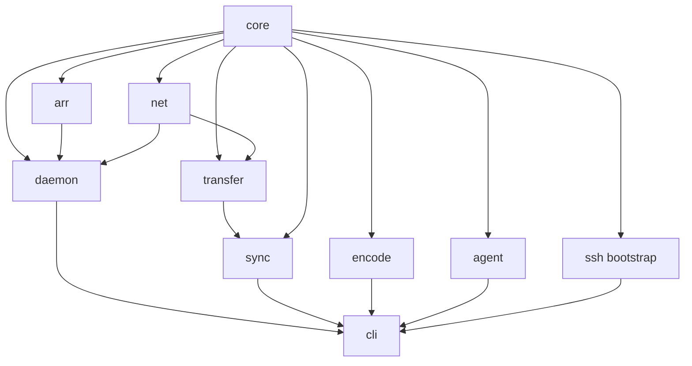

# Module map

Intended module responsibilities for mediaops. Architecture owns crate-graph HOW and may shuffle impl crates. It must not put grabber HTTP in the CLI or FTP in transfer.

## Philosophy

| Law | Meaning |
| --- | --- |
| Thick libraries, thin CLI | Completeness lives in libraries. CLI never hits a missing endpoint and grows a one-off curl. |
| CLI is the API | Every capability is a subcommand. Cron/systemd call the CLI. `--json` on every command. Completions and TUI are skins, not a second API. |
| TUI is a skin | Optional attach. Progress is structured log. Timers must not require a TUI. |
| Reconciler, not script runner | Desired-state document in the home repo. Plan is the default verb; run = plan + apply. Twice is a no-op if Edge, Grab, and Paths already match. |
| Two machines, one operator | Seedbox = rented working memory. Home disk = archive and playback surface. App owns the pipe. |
| Local FS is library of record | *arr is an optional grabber. `grabber=None` is legal. |
| Identity ≠ path | TitleId (TMDB/TVDB/MBID + kind). Folders are a rendered view. |
| One-way pull | Remote Range → staging `.partial` → verify → atomic install. Never two-way. Never a third cloud. |
| Formal API is mediaopsd | Home CLI never speaks Sonarr HTTP. SSH is bootstrap. |
| External binaries are deps | mediaopsd (in-process overlay), ssh (bootstrap), ffmpeg/NVENC, systemd-user. Optional tailscale/wireguard. No rathole/rclone/rsync required for pull. |

Sync decides *which* titles move. Transfer moves bytes (Range RPCs). SSH gets the daemon onto the box once. Push is not a product surface.

## Intended modules

| Module | Owns |
| --- | --- |
| core | TitleId, PathSchema, desired-state, Plan, RPC schema, policies, provider **trait**, title-index types. No SSH, no HTTP, no ffmpeg. |
| net | gRPC listen / reverse-connect, mTLS CA+certs, reconnect; optional Tailscale/WG underlay. |
| ssh | `~/.ssh/config`, copy binary, systemd user unit, mint/place certs, Swizzin package/nginx **root**. |
| arr | Full Servarr + SAB + qBit HTTP; **only linked into the daemon**. |
| daemon | `mediaopsd`: gRPC+mTLS server, localhost *arr, Range RPCs (allowlist). Seedbox plus optional home. |
| transfer | Home `PullFile`; parallel Range RPCs; probe concurrency; `.partial`; BLAKE3 per-range + whole-file. |
| sync | What to Copy/Skip/Review; holds; reclaim; never torrent roots. Consumes PullFile. Speaks grabber only via daemon RPC. |
| encode | EncodePolicy execution; NVENC; reversible transcode. Home GPU only. |
| agent | `AgentTask`, dossier, claude/codex/grok subprocesses. Propose; PathSchema writes. |
| cli | Home binary on PATH (`mediaops`). Talks to **local** mediaopsd only. |

### Intended dependency direction

Architecture may shuffle; this is the responsibility graph, not a frozen crate list.

Home also runs mediaopsd (unix socket) so the CLI never holds overlay credentials in every invocation.

## core

Shared language: identity, paths, desired state, plans, budgets, policy data, job state.

| Abstraction | Intent |
| --- | --- |
| TitleId | Kind + TMDB/TVDB/MBID. Folder/file names are PathSchema renderings, not identity. Music remaster year is an identity rule (Relayer 1974 vs Relayer.(2013)). |
| PathSchema | Versioned grammar → paths. Single writer for generated docs (`docs render` / AGENTS.md), install gate, agent proposals, lint. Composable parsers (movie / episode / track) + explicit reject bins (`needs-split`, `needs-year`). Scene-tag strip with tests from real sins (REPACJ, REPACK, PROPER). Round-trip: `parse(render(id)) == id`. Year lives in the folder and the file the same way. Remote allowlist of roots; unknown paths error. Walk never follows symlinks off the allowlist. Never torrent save paths. |
| Desired-state document | Only user-facing config. Lives in the home repo; the box is disposable. Every former `apply-stack.py` flag is a typed field. Snapshotted at plan start; no hot-reload mid-copy. Cloneable: same binary, different file. |
| Plan + actions | First-class artifact. Actions at least: Copy, Skip, Review, Unmonitor, DeleteRemote, Encode, Reclaim, plus edge/grab apply as reconcile steps. Plan default; run = plan + apply. Unified diffs of ini/xml/nginx before write. |
| Job state machine | Jobs have states. Timers only make-progress-on-ready-jobs. Config snapshot is per-plan. |
| ResourceBudget | `max_copy_gib`, `min_free_gib` (watermark), `max_nvenc`, lock. No magic numbers in source. Preflight fail if a copy would breach watermark. |
| GrabPolicy | Data: delay, quality, indexer priority, client priority, versioned custom-format packs (Prefer H.264, HEVC last, 10-bit last, AV1 last). Applied by arr, not clicks. Changes are explicit commands with a diff. |
| EncodePolicy | `(codec, depth, container, hdr)` → Keep \| NvencH264 \| Refuse. When encode is chosen, the target is H.264 8-bit. HDR/DV and 2160p remux are Keep-forever. Playback matrix: v1 client profiles Chrome, TV, Shield × codec (config), without a Plex/Jellyfin client. Upgrade class is never \| if-better-profile \| if-user-marked-UHD; default never. |
| ReclaimPolicy | Constraints (private, seeding, imported) × objective (free-space percent). Replaces leftover timers. Never touches private-under-goal. |
| Hold | Typed inbox: Approve / Reject / Research. Not a folder a media server might ingest. Reject = never pull this release, let *arr try another. Approve = promote to library. Auto-approve forbidden. No agent-approve path in v1 (so no confidence floor). LLM research deferred. |
| Provider | Install/remove/pin packages. v1: Swizzin + AlreadyThere. Trait may name DockerCompose / Ultra.cc; those are unimplemented + tests, not v1 ports. |
| EdgeInvariant | bind `127.0.0.1` + `url_base` + Host `$host` + Forms auth. Types here; checks in arr (API) + ssh (nginx). |
| Connection | SSH bootstrap `{host, port, user, auth}` plus gRPC bind (host/port) and mTLS identity. This box binds. Reverse-connect and Tailscale/WG designed, unused by default. SeedIt4Me `2097` is bootstrap, not the API. |
| Title index | Local sqlite: TitleId ↔ path ↔ inode / BLAKE3. Export/import for new-machine bootstrap even before files exist. |
| Wants / priority | Music-first then videos under budget is a planner law. `watch` is a per-title want. Generalized wants queue deferred. Not a hardcode inside pull. |
| Lock | Machine-global flock: pid, started_at, command. `status` shows who holds it. Lock conflict = distinct exit code + skip-with-reason. |

Must not: talk to the box, *arr, rclone, or ffmpeg; embed path strings as identity; know Swizzin panel URLs or rclone flag names; configure Jellyfin/Plex.

Replaces as types, not as I/O: laws currently trapped in comments of `apply-stack.py`, `sync.py`, `encode_h264.py`, reclaim, review, `SEEDBOX.md` / AGENTS.md. Docs are generated from PathSchema so they cannot lie.

## net

Listen, accept, reconnect — inside mediaopsd. Rathole the *idea* (managed bind + auth + stay-up). Do not ship or install the rathole app.

| Mode | When |
| --- | --- |
| gRPC + mTLS listen (default) | mediaopsd binds. Self-signed CA, server cert, client cert generated at bootstrap, stored as gitignored files next to desired-state (fingerprints in desired-state, never PEMs). v1 is mTLS only; bearer token deferred. Seedbox (reachable) is the bind side; home is the client via home mediaopsd. |
| Reverse-connect (same binary) | Designed, unused by default. If the bind side is NATed, the far side dials out — still gRPC/mTLS. Not a third-party client. |
| Tailscale / WireGuard | Designed, unused by default. Optional underlay. Userspace Tailscale if no TUN. Headscale OK. Not required to demo the first Range RPC. |
| Cloudflare Tunnel / rathole / frp apps | Not used. |
| `ssh -L` / `-R` | Bootstrap last-ditch, then gone. Not the product. |

Identity is the bootstrap CA. Reconnect and health live here.

Must not: shell out to rathole, frp, or cloudflared; expose *arr ports (only mediaopsd gRPC); carry 80 GiB through Cloudflare; be a SOCKS wrapper the CLI uses to curl Sonarr.

## ssh

Bootstrap and Swizzin **root** operations only: copy `mediaopsd`, systemd user unit, overlay enroll, box install / nginx files. After enroll, doctor/apply/copy do not use SSH.

Mux ControlMaster is fine for short bootstrap exec. Never bulk copy over SSH.

| Abstraction | Intent |
| --- | --- |
| SshConfig import | `~/.ssh/config` `Host seedbox` |
| Bootstrap exec | Install daemon + overlay. Root only for nginx + packages |
| SwizzinBox | Provider impl: packages, pins, nginx. Edge check after install |
| AlreadyThere | No-op install; configure via APIs |
| Edge files | Hash nginx app confs; EdgeRepair transaction |

Must not: be the control API; local-forward *arr for apply; own `.partial` or rclone.

Replaces first-time scp of `apply-stack.py` / `fix-nginx.sh`. Not the daily path.

## daemon

The seedbox (and home) long-running service. This is the formal API.

| Surface | Intent |
| --- | --- |
| gRPC | Plan, apply, doctor, holds, df, qBit guard, key discovery, GrabPolicy — mTLS required |
| Range RPCs | Parallel GetRange for allowlisted library/usenet-complete paths. Same listener, same certs. No torrent-root listing |
| Local *arr | arr clients against `127.0.0.1` + url_base. Never bind *arr off localhost |

systemd `--user` on the seedbox. Home CLI talks to home mediaopsd over a unix socket; home mediaopsd is the overlay client.

Must not: require `ssh -L 8989`; serve `_incoming` or torrent incomplete; run encode (home GPU).

Replaces “SSH in and curl localhost”; ad-hoc forwards; treating nginx `/sonarr` as the automation API.

## arr

Full HTTP clients for the grabber stack, linked only into mediaopsd. *arr is optional at runtime (`grabber=None`); this module is still complete. Surface catalog: [grabber-inventory.md](grabber-inventory.md).

Must not: install packages or rewrite nginx; copy bytes; walk torrent save paths as library files; cherry-pick “just queue + history”; echo API keys.

## transfer

One-way pull that fills the WAN pipe. Parallel Range RPCs on mediaopsd gRPC/mTLS.

`PullFile` (one-way). Staging `.partial`, per-range BLAKE3, whole-file BLAKE3, atomic rename. `*.partial` sacred. Resume lists completed ranges and continues. Reclaim uses only the install digest. `Push` is out of product scope.

| Surface | Intent |
| --- | --- |
| Remote spec | gRPC endpoint + client cert from bootstrap; allowlist prefix |
| Operations | Stat, GetRange, listing via RPC (not HTML indexes, not torrent trees) |
| Concurrency | N parallel Range RPCs; many files vs many ranges on one file; do not collapse onto one TCP |
| Probe + persist | Raise N until throughput plateaus; persist |
| Staging | Destination `.partial` then rename |

No emergency rsync-ssh path. Not FTP. Not SFTP. Not rclone.

Must not: decide Copy vs Skip vs Hold; delete torrents; use FTP PASV, per-file SFTP, shell rclone, or rsync-ssh for the overlay pull; copy to a second cloud; follow symlinks into torrent trees.

Replaces the byte-move half of `sync.py` (live FTP `rclone copyto` is what we are leaving).

## sync

Reconcile remote buffer vs local archive. Planner, not the pipe. Consumes PullFile. *arr/unmonitor/SAB/qBit go through mediaopsd RPC, not a local HTTP tunnel.

| Abstraction | Intent |
| --- | --- |
| Planner | Walk allowlisted remote roots only. Never torrent roots, never `incomplete`. Produce a Plan. Music-first then video under `--max-gb` / remaining-home-disk. |
| Copy path | Remote → staging `.partial` → verify → atomic install. Usenet complete after Copy: DeleteRemote. Library hardlink of a torrent: leave the torrent. |
| Skip vs surplus | Skip ≠ surplus. Surplus = remote may go after local hash proof. |
| Holds inbox | `importBlocked` etc. is a product feature: *arr message + ffprobe + approve/reject/research. Age, size, reason. CLI/TUI inbox. needs-split is a workflow (agent), not a pile. |
| Install gate | Schema parser is the only writer. Spaces, leftover scene tags, `Season 1` folders: lint-on-install rejects. `library lint` finds survivors. |
| Reclaim execution | Policy from core. Preview ranked by ratio, private, age. qBit guard before unlink. Dry-run or it does not exist (no silent leftover timer). |
| Resume | `sync resume`: list `.partial`, continue. GC never deletes them. |
| Reconcile | After manual copy: tell *arr the truth (Unmonitor / imported). |

Must not: embed rclone flag strings; two-way sync or mirror local deletes; delete qBit data on Copy; walk `/torrents` as archive; auto-approve holds; encode (enqueue Encode actions only); speak Sonarr HTTP from the planner.

Replaces `sync.py` / media-sync planner laws; review hold inbox; reclaim execution (not the leftover no-op timer).

## encode

Home-GPU transcode so Chrome/TV can play. Seedbox is dumb disk + pipe — never encode on seedbox CPU. Policy packs drive the encoder so docs cannot lie.

| Abstraction | Intent |
| --- | --- |
| Policy execution | Core EncodePolicy + playback matrix in config (Chrome, TV, Shield). When encode is chosen, target is H.264 8-bit. Scan rules are explicit (e.g. `movies/**/*.mp4` HEVC10; series-skip is a named rule, not an accident). |
| Hardware probe | NVENC concurrency from probe, not hardcoded 8. This box caps at 3; budget `max_nvenc` is the ceiling. Semaphore is a visible/pausable queue, not a surprise after sync. |
| Reversible transaction | Write `.converting`, replace, move original to backup-hevc-originals. Never delete original until replace succeeds. |
| Refuse class | HDR/DV, 2160p remux: Keep-forever. |
| Runtime deps | ffmpeg / jellyfin-ffmpeg / NVENC as probed externals, not vendored. |

Must not: configure Plex/Jellyfin clients, users, or libraries (client profile names in config are encode inputs, not a media-server API); run on the seedbox; invent quality upgrades when disk is bored; be the schema writer.

Replaces `encode_h264.py`.

## agent

Typed LLM tools for research/debug. An LLM is a subprocess, not an in-process brain. May propose; PathSchema is the only writer.

| Abstraction | Intent |
| --- | --- |
| AgentTask | `{prompt_template, inputs, output_schema, timeout, cwd sandbox, binary}`. Binary = claude \| codex \| grok (pick per task: research may web-search; debug-media may be local-file). App only cares that output matches schema. |
| Dossier | Per-title bundle: ffprobe, nfo, *arr payload, neighbors — not the universe. Max-bytes budget per task. |
| Propose vs apply | Default dry-run. Apply is an explicit grant. Schema parser rejects spaces/scene tags even if the model invents them. |
| Capabilities | Tokens from ssh/arr/fs/probe. Default read-only: ffprobe, ls, *arr GET. ArrPost / SshExecAllowlist are grants. Never ssh root. GrabPolicy changes are not casual POSTs. |
| Jobs | `research` (scene name → TitleId without download; theatrical-cut / edition / runtime vs ffprobe); `debug-media` (ffprobe + mediainfo + a **local** client profile → Direct Play vs transcode advice, no Jellyfin API); hold Research. |

Must not: write library paths except through schema-validated apply; dump the whole tree into context; hold a ControlMaster as root; be the TUI.

Replaces tribal “open 12 tabs” research. Does not replace review as a queue — it is a verb on a hold.

## cli

One binary on PATH (`mediaops`). Composition root. Thin: parse, snapshot config, take lock, call libraries, print `--json` or human, optional TUI attach.

| Area | Subcommands (intent) |
| --- | --- |
| Seedbox | `seedbox bootstrap`, `doctor`, `repair edge`, `apply`, `df`, `upgrade`, `ui <app>` (ui deferred from first demo) |
| Library | `library bootstrap`, `lint`, `relocate` |
| Plan/run | `plan`, `run`, `status`, `sync resume` |
| Holds | `hold list\|approve\|reject\|research` |
| Reclaim | `reclaim preview\|apply` |
| Encode | `encode scan\|run\|pause` |
| Transfer | `transfer probe` |
| Why / watch | `watch TITLE` enqueues a want (and monitoring if grabber is on) and exits; `why TITLE` / `status` are the peek (grab→import→hold→pull→encode→library, including stuck states). No Jellyfin URL as a product requirement. |
| Agent | `agent research\|debug` — deferred from first demo |
| Docs | `docs render` |
| Cockpit | `tui` — deferred from first demo |

Doctor scheduled is read-only. Write repairs need `--repair` + local confirm flag or pin. `doctor --repair` from a public laptop unattended is a failure mode.

Idempotent apply. Distinct lock exit code. Structured log. systemd-user adapter: oneshot + `OnUnitInactiveSec` + flock, all three. v1 scheduler = that adapter only.

Must not: contain *arr HTTP or overlay internals (talk to local mediaopsd); be the only UI (TUI-only is a failure mode); start a public status daemon.

Replaces Python venv, `PYTHONPATH`, one-shot wizards that only work once (every wizard step is a reconcile).

## Provider placement (no extra module in v1)

| Piece | Where |
| --- | --- |
| Provider trait (`SwizzinBox`, `DockerCompose`, `AlreadyThere`) | core |
| AlreadyThere | core (no-op install; configure via APIs) |
| SwizzinBox | ssh (root: packages + nginx) |
| DockerCompose | stub + tests only |
| Ultra.cc / QuickBox | non-goal for v1 — unimplemented trait variants, not ports |

v1 provider = this SeedIt4Me/Swizzin box + this home disk. Version pins are first-class. Panel click is never an upgrade path.

## Tribal scripts → modules

Every script is a transaction type in a Plan, not a wrapped subprocess of the old Python.

| Tribal | Becomes |
| --- | --- |
| `apply-stack.py` | core desired-state fields + ssh packages/nginx + arr full apply (sets, CF, host, categories) |
| `fix-nginx.sh` | ssh edge files + hash/drift; cli `seedbox repair edge` transaction with apply-stack unit |
| `sync.py` / media-sync | sync planner + transfer Range RPCs + daemon gRPC |
| `encode_h264.py` | encode (policy-driven; 10-bit included when policy says so) |
| reclaim (incl. leftover timer) | core ReclaimPolicy + sync execution + arr qBit guard; dry-run or remove |
| review / holds | sync hold queue + cli inbox (agent research verb deferred) |
| `SEEDBOX.md` / AGENTS.md hand-edits | core PathSchema → `docs render` |
